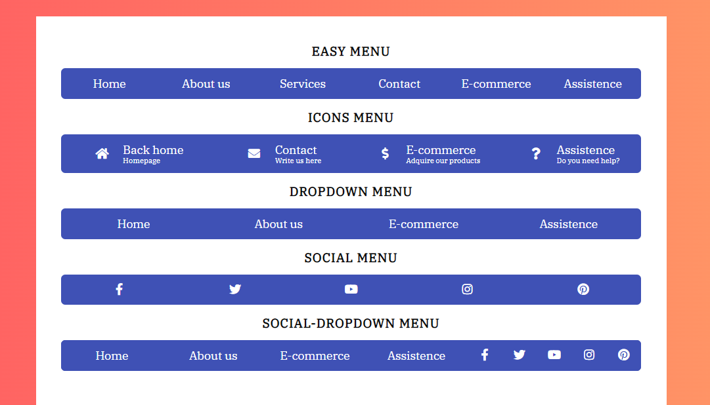
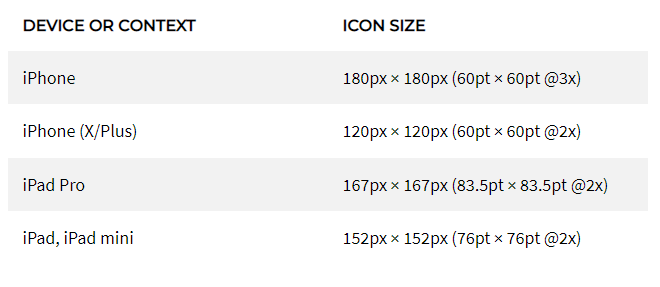
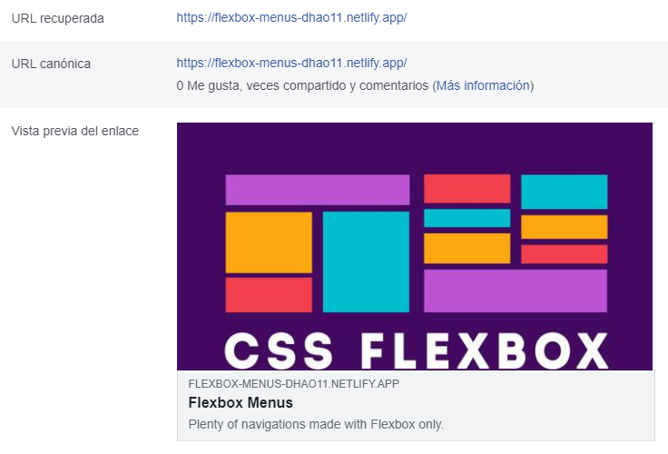
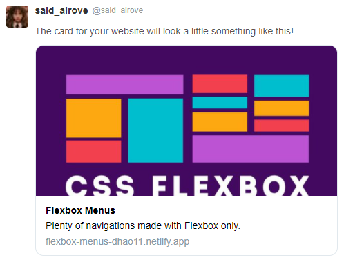

# [flexbox-menus](https://flexbox-menus-dhao11.netlify.app/)
This is the fourth project from Juan Pablo's course of [CSS Grid and Flexbox](https://www.udemy.com/course/css-grid-y-flexbox-la-guia-definitiva-crea-10-proyectos/).

This was an easy project that helped me to improve my skills on Flexbox, in like manner this might give me a hand when building other projects because I'll have already done common navigation components, therefore I'll know how to build them faster, or otherwise ... I'll be able to reuse the ones that are here.

> **Disclaimer:** I'm starting to learn how to use **Git/Github** correctly, therefore there'll be plenty of pull requests, commits and other stuff as tests in this repository, however, *this won't represent my way of working forever*, I'll learn more things along the way as always :D!.

## Table of contents
* [Preview](#preview)
* [What I learned](#what-i-learned)
* [Open Graph](#open-graph)
    - [Facebook](#facebook)
    - [Twitter](#twitter)

## Preview

## What I learned
* I didn't have too much opportunity for learning plenty of things, but as always, I tried to add something new to the project. In this case, I figured out that I can (and as something recommended by Apple, I must) add different **apple-touch-icon** widgets with various sizes (sizes that are mandatory, otherwise, if the sizes aren't the ones accepted by Apple.. Safari will ignore it) in order to optimize the resolution of the image according to the situation where's needed (notification icon, home screen icon, etc.).

> **Note:** these are the sizes (these are the most important sizes, but there are more sizes according to Apple, thus if you want more information [check this out](https://developer.apple.com/design/human-interface-guidelines/ios/icons-and-images/app-icon/)):

> **Note:** something important to consider is that we must use PNG files when trying to use the **apple-touch-icon** element.

> **Note:** there's an interesting [page](https://iconifier.net/) that helps us to create different **apple-touch-icon** widgets sizes in order to be more efficient (it also gives us the HTML code with the **sizes** attribute to help Safari understand which icon should take).

* As I mentioned in the [last project](https://github.com/said-alrove/freelancer-home) I started to learn **Git / Github** more in detail and this time I learned things such as:
    - How to create a **. gitignore** file in order to avoid adding files or directories to the staging (index).
    - How to track the versions of your project in a better way with the **git tags**.

    > **Note:** the way how you add them is by using the **git tag** command followed by the **- a** flag with the tag name (v0.1 for example) and the **-m** flag with a summary that describes what that version is about and the number of the commit the version will be related to (if it's that you want to create a tag for a commit other than where the head is).

    - How to see the existent tags in a repository with the **show-refs** command followed by the **--tags** flag (this will show you the tags you've created with their unique ID, but **be careful**... these IDs aren't the commit they're related to).
    - How to see the all the information about the tags you've created (including the commit ID they're related to) with the **git show** command followed by the tag name (v0.1 for instance) or with nothing else if it's that you'd like to see all the information of all the tags that have been created in the project.
    - How to push a tag from your local repository to your remote repository with the **git push** command followed by the name of the repository (let's say **origin** for instance) and the **--tags** flag.
    - How to remove a tag from the local repository with the **git tag** command followed by the **-b** flag and the name of the tag you'd like to remove.
    - How to remove a tag from a remote repisitory with the **git push** command followed by the name of the repisitory (let's say **origin** once again) and the **:refs/tags/v0.1** sentence (the v0.1 represents the name you assigned to the tag).

    > **Note:** you can also use the **git tag** command followed by the **-b** flag with the name of the repository the flag belongs to (let's say **origin** once again) and the tag name at the end.

* I figured out that when using the **link** element with the **rel** attribute set to canonical, we should use the absolute URL to the page (not only the domain URL as I thought).

* I had some doubts about the deployment enviroment due to Netlify is connected with the repository in its main branch and Github pages to its dev branch (to test things before send them to the main branch), but the problem is that in the HTML files (or whatever other file that requires assets from the repisitory) I have to use the URL of Github pages (that how I mentioned before, is connected to the dev branch) to have access to those assets, therefore I don't know how to avoid that if a modify an asset, the page deployed in Netlify don't use those new and modified files (because they're still being tested) and instead uses the files that are in the main branch (I hope I had been clear enough with this point).

> **Note:** obviously (I think) most of the web projects have a cloud where all the files from the main branch in the Github repisitory are hosted (I guess that's **production**), but I'd like to solve this problem with Github and Netlify only, therefore I'll continue looking for more information.

> That'd be everything for this project :D.

> **P.D.** I started to think about the idea of pointing Github pages to the main branch and instead of trying to test things there (and have troubles with Netlify because of it), test stuff locally in my computer with live server, for my, right now, sounds better.

## Open Graph

### Facebook

### Twitter 
